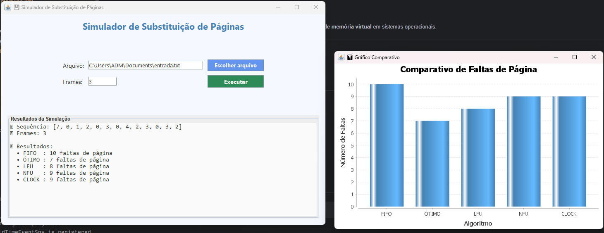

# Simulador de Algoritmos de Substituição de Páginas

Este projeto foi desenvolvido como parte da disciplina de **Sistemas Operacionais** do curso de **Ciência da Computação**.  
O objetivo é implementar um **simulador em Java** para avaliar o desempenho de diferentes algoritmos de substituição de páginas no gerenciamento da memória virtual.

---

## Algoritmos Implementados
- **FIFO (First In, First Out)** → substitui a página mais antiga na memória.
- **Relógio (Clock / Segunda Chance)** → utiliza um ponteiro circular para dar uma segunda chance às páginas recentemente acessadas.
- **Ótimo (Optimal)** → substitui a página que será usada mais tarde no futuro (referência teórica).
- **NFU (Not Frequently Used)** → substitui a página menos frequentemente utilizada, com base em contadores de acesso.

---

## Objetivos
- Simular o comportamento dos principais algoritmos de substituição de páginas.
- Comparar quantitativamente o número de **faltas de página** em diferentes cenários.
- Fornecer uma ferramenta prática e didática para apoiar o estudo de **gerenciamento de memória virtual** em sistemas operacionais.

---
## Compilação
- javac -d out $(Get-ChildItem src -Recurse -Include *.java)

---
## Execução
- java -cp out br.com.simulador.model.Main  

## Execução - gráfico
- mvnd clean compile
- mvnd exec:java

## Resultado 

---